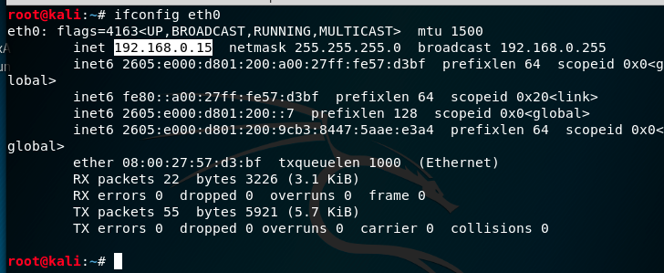

# Security+ - ARP protocol, poisoning and other tools

#### Pre-requisites:
* Basic network understanding
    * Subnet/CIDR Notation
* Virtualbox w/ Kali
* Virtualbox w/ Ubuntu
* Virtualbox w/ Windows
    
##### Desired Outcome(s):

* Understanding of the purpose of the ARP protocol is to map IP addresses to MAC addresses and that devices cannot communicate over IP without knowing the MAC address associated with that IP address
* Understanding of the `arp` utility
* Understanding that ARP is a level 2 or data layer protocol in the OSI model
* Understanding of the structure of the ARP packets
* Understanding of capturing ARP traffic on a network
* Understanding of what ARP poisoning looks like

    
#### Setup:

* Open VirtualBox

* Select the Network tab on **ALL** your virtual machines with the following settings:

    * Kali
    * Windows 10
    * Ubuntu 18.04

* Select the `Bridged Adapter` option in the `Attached to:` drop down menu

* Click the Advanced option

* Select the `Allow All` option in the `Promiscuous Mode:` drop down menu 

* Start Kali3 virtual machine 

* Start Ubuntu virtual machine

* Start Windows 10 virtual machine

* Open a terminal and take note of your current assigned IP address for each machine using: 
    
    * Linux(Kali/Ubuntu): `ifconfig` or `ip addr`
    * Windows: `ipconfig /all`

**Linux (Kali and Ubuntu)**

**Windows 10**

* Start Wireshark on your **HOST** operating system

* On the start screen select your wireless interface of your **HOST** operating system

* In the `...using this filter:` box under the `Capture` section enter the following filter to only capture traffic from our Kali virtual machine

* Enter the following value: `arp`

* Hit Enter or click on the `Start capturing packets` button' to start your capture session

* You should start to see ARP reply/response pairs show up in your packet capture window

**IMPORTANT:** Notice how the response to each request is announcing the MAC (physical) address of the machine associated with that IP address. 

* Next we'll start to inspect the ARP tables in each of our machines, which is where the above entries are stored

* On your **HOST/Windows or Mac** operating system, start a terminal session and run: `arp -a`

* On your **GUEST/Kali** operating system, start a terminal session and run: `arp`

* On your **GUEST/Ubuntu** operating system, start a terminal session and run: 
    * `sudo apt-get install net-tools`
    * `arp`

* Analyze the results and take note of the following:

    * ARP request/reply pairs
    * ARP packet structure
    
* You should see all machines showing the same IP and MAC address for the gateway address or router

* Now we're going to ping the Ubuntu machine from the Kali machine and see how that affects the ARP table

* Next we're going to setup port forwarding on our Kali machine to enable an arp spoofing attack with the following command:

`echo 1 > /proc/sys/net/ipv4/ip_forward`

* We'll also need to know the IP address of our router, which we can get with the following command:

`ip route`

* We now need to target the victim and provide:
    * The interface we're using on the attacking machine
    * The target IP address of the victim
    * The router IP address we're spoofing
    
* Start wireshark on your Kali machine and filter for `arp` packets
    
* Start spoofing with the following command with **your** settings:

`arpspoof -i eth0 -t 192.168.0.52 -r 192.168.0.1`

* You should see Kali sending responses directed to the victim claiming to be the router

* If you go back to the victim you will see that the router MAC address has changed to the attacker

* Now if you go back to Kali and filter for the host IP and http traffic you can see any traffic originating from the victim machine

* There are several filters you can use to see traffic more clearly:

    * All HTTP Traffic (won't show HTTPS trafic): `http`
    * Filter by known Ethernet address: `ether host 08:00:27:6f:66:56`
    * Filter by domain (with name resolution enabled): `http.host == "www.stealmylogin.com"`
    * Filter by HTTPS: `ssl`
    * Filter by HTTP and HTTPS: `http or ssl`
    * Filter by domain names (contains): `http.host contains ".com"`
    * Filter by domain names (explicit): `http.host == www.stealmylogin.com`
    * Filter by extension (contains): `http.request.uri contains ".html"`
    * An attacker can also use tools like `urlsnarf` and `driftnet` to filter data going through the interface when performing a spoof attack

#### Challenges
1. Try to modify the names of the hosts to more easily identify which machine(s) traffic is going to/from
1. What does ARP stand for?
1. What is ARP poisoning and how does it work?
1. What kind of attacks can ARP spoofing enable?
1. What are some security measures for protecting yourself from ARP spoof attacks?
1. Run an nmap ping scan on the local network to see ICMP requests substituted for ARP for faster response

#### Interesting Filter(s)

#### Resources
* http://www.blacklabssecurity.info/arp-spoofing.html
* https://fossbytes.com/arp-spoofing-attacks-detection-prevention/  
