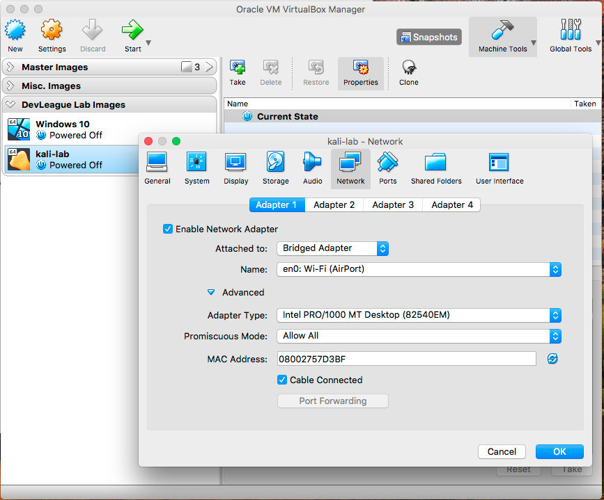
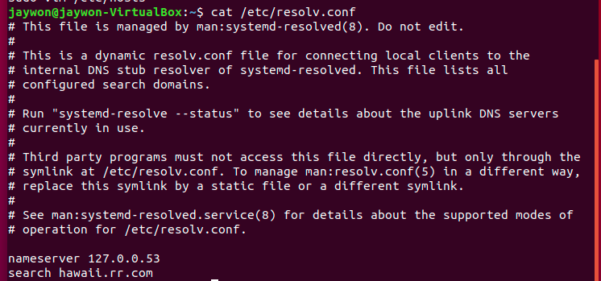

# Security+ - DNS Server Setup w/ bind, dig, nslookup

#### Pre-requisites:
* Basic network understanding
    * Subnet/CIDR Notation
    * Ports
* Wireshark
* Virtualbox w/ Kali
* Virtualbox w/ Ubuntu
    
##### Desired Outcome(s):

* Understanding of the purpose of the DNS protocol
* Understanding of capturing DNS traffic on a network
* Understanding of the process of installing and configuring a DNS server
* Understanding the concept of a DNS cache
* Understanding of ethernet interfaces and how to manage their settings using `ip address` and `ip link` commands
* Understanding of basic `dig` utility commands
* Understanding of basic `nslookup` interactive utility commands
* Understanding of basic `dnsrecon` utility commands
* Understanding of DNS based attacks
* Understanding of location and purpose of common Linux DNS configuration files: `/etc/hosts`, `/etc/hostname`, `/etc/resolv.conf`

#### General DNS Lab

* Start Wireshark on your **HOST** operating system

* On the start screen select your wireless interface of your **HOST** operating system

* In the `...using this filter:` box under the `Capture` section enter the following filter to only capture traffic from our Kali virtual machine

* Enter the following value: `tcp port 80 or tcp port 443 or udp port 53`

* Hit Enter or click on the `Start capturing packets` button' to start your capture session

* In the Apply a display filter box, further filter your view to include `http`, this will show you only HTTP request/responses and not other misc. TCP requests

* Open your Chrome web browser and visit `http://turtles.com/`

* You should see a DNS reply/response pairs show up in your packet capture window

* You can also filter for specific queries with the following Wireshark filter: `dns.qry.name contains turtle`

**NOTE:** Try to visit the page again and you will notice that a second DNS request will not be sent in Wireshark.

* To view your browsers DNS cache enter the following URL in your Google Chrome browser and search for turtles: chrome://net-internals/#dns

**NOTE:** Different browsers and operating systems handle DNS caching differently

#### VirtualBox NAT Network Setup

* Open VirtualBox

* Select the Wirehark->Preferences option

* Select the Network tab

* Click the Add Network icon, right-click on the newly created `NatNetwork` and verify that you have the following settings:

* Click OK to save your changes and exit the VirtualBox Preferences dialogue box

* Select the Network tab on **ALL** your virtual machines with the following settings:

    * Kali
    * Ubuntu 18.04
    * Windows 10

* Select the `NAT Network` option in the `Attached to:` drop down menu

* Select the `NatNetwork` option

* Click the Advanced option

* Select the `Allow All` option in the `Promiscuous Mode:` drop down menu 

* Start Kali3 virtual machine 

* Start Ubuntu virtual machine

* Start Windows virtual machine

#### DNS Tooling Lab

* Login to your Ubuntu virtual machine and open a terminal session

* Install Wireshark and view all DNS traffic as you run through the various commands

    * sudo apt-get install wireshark
    * sudo wireshark
    * apply filter: dns.qry.name contains devleague
* Go over the following commands using the `dig` command line utility:

    * dig devleague.com ALL (All DNS records)
    * dig devleague.com A (domain/sub-domain records)
    * dig devleague.com CNAME (Alias records)
    * dig devleague.com MX (Mail records)
    * dig devleague.com NS (Name server records)
    * dig devleague.com TXT (Text records)
    * dig devleague.com SOA (Authoritative server records)
    * dig @8.8.8.8 devleague.com ALL
    * dig @8.8.8.8 devleague.com A
    * dig @8.8.8.8 devleague.com CNAME
    * dig @8.8.8.8 devleague.com MX
    * dig @8.8.8.8 devleague.com NS
    * dig @8.8.8.8 devleague.com TXT
    * dig @8.8.8.8 devleague.com SOA
    * dig -x 1.1.1.1 (Reverse Lookup/PTR records)
    * dig axfr @nsztm1.digi.ninja zonetransfer.me (Zone Transfer) 
    
* Go over the following commands using the `nslookup` command line utility:

    * server
    * set type
    * debug
    * nodebug
    
* Go over brief usage of `dnsrecon` command line utility:
 
    * dnsrecon -t rvl -r 138.197.206.1-138.197.206.254 (Kali DNS reverse lookup on range)
    * dnsrecon -t rvl -r 10.0.2.1-10.0.2.254 (Private network)
    
* TODO: Steps for finding authoritative source and querying using `nslookup`
    
* Install `whois` command line utility for looking up Domain ownership information:

#### Linux DNS Settings Lab 
* Show local hostname with two commands:
    
    * `hostname`
    * `cat /etc/hostname`
 
    
* See DNS resolution settings in `/etc/hosts`

* Ping entries in `/etc/hosts` and analyze results

* Add entry to `/etc/hosts` file to see DNS override

* Now ping devleague.com and pay attention to the IP address it resolves to

**NOTE:** You could in theory manage entire networks this way by having the same file on each computer on a network but that becomes very difficult to manage.

**TODO** Setup EC2 with cloned devleague website and elastic IP

**TODO** Add steps to configure static IP addresses to all servers and assign them names in `/etc/resolv.conf`. Ubuntu should be reachable by name in browser w/ Nginx running

#### Setting up DNS Server

* First, make backup copies of the files /etc/hosts, /etc/named.conf, resolv.conf, and /etc/sysconfig/iptables.

* We are now going to associate a **static IP address** with our Ubuntu server so that it's IP address doesnt change:

* Next, install `bind` using the following command: `sudo apt install bind9`

* Verify your `bind` installation was successful by running the command: `named -v`

* Next, we'll take a look at the configuration directory and associated files with the following commands:

    * cd /etc/bind
    * ls 
    

* If we start to analyze the following main configuration files we can start to see how configuration files work in many applications:
    
    * named.conf
    * named.conf.options
    * named.conf.local
    * named.conf.default-zones
    
    

    
* We can also see that the default port **53** has been opened on our Ubuntu host if we run a port scan from our Kali machine:

* Now that we have a DNS server running properly with default configuration we're going to add a zone file, which stores the various records of a domain
    

* Browse to the `/var/cache/bind` directory where zone files are hosted and loaded into memory. We can view current contents with the following commands:

    * cd /var/cache/bind
    * ls
    

* Download the prepared zone file here: https://gist.github.com/jaywon/92b6d50a186b7d6f8208ebd53db38ac7

* **NOTE:** Make sure the listed IP address' are the same IP address of your Ubuntu server 

* Copy the contents of that file to: `/var/cache/bind/db.devleague.com`

* Test to see that your changes are correct:

* Once the configuration is OK, we have to add a zone entry to `/etc/bind/named.conf.local`

* Restart your service 

* Now we can test our changes by targeting our DNS server directly using the following command: `dig @10.0.2.11 devleague.com`

* What does it look like when we don't target our DNS server directly? Try issuing: `dig devleague.com`

* Now, we want to make our DNS server the default for this machine by adding our IP to the `DNS` setting in `/etc/systemd/resolved.conf`

* Restart your server after saving your file with: `sudo restart 0`

* We should be able to now run our `dig devleague.com all` command without specifying a server and see results from our own DNS server.

* If you ever need to flush your local DNS server cache run the following commands to restart the service and view current cache statistics:

    * sudo systemctl restart systemd-resolved.service
    * sudo systemd-resolve --statistics
    

**TODO:** FINISH steps of configuring Kali to use this DNS server via `/etc/resolv.conf` and ping/dig devleague.com, view in Wireshark

* Now lets add a fake DevLeague HTML page on our Ubuntu server:
    
    

#### Securing DNS

* Edit your `/etc/resolv.conf` file to use notable public DNS servers

    * 1.1.1.1 (Cloudflare)
    * 8.8.8.8 (Google)
    * 8.8.4.4 (Google)

#### Challenges
1. What does DNS stand for?
1. What is a cache?
1. Explain in detail how the Global DNS system works
1. What is a zone transfer?
1. What is the `dig` utility for?
1. What is the `nslookup` utility for?
1. What are some DNS related attacks and how do they work?
1. What does BIND stand for?

#### Interesting Filter(s)

#### Resources
* https://opensource.com/article/17/4/introduction-domain-name-system-dns (GROK this)
* https://opensource.com/article/17/4/build-your-own-name-server (Informational/outdated)
* https://www.tecmint.com/ip-command-examples/ (GROK this)
* https://www.hackersgarage.com/dig-linux-dns-lookup-utility-cheat-sheet.html (GROK this)
* https://bitrot.sh/cheatsheet/06-12-2017-dns-recon-cheatsheet/ (GROK this)
* https://www.dnsdumpster.com/
* https://digi.ninja/projects/zonetransferme.php
* https://debian-handbook.info/browse/stable/sect.hostname-name-service.html
* https://opensource.com/article/17/4/introduction-domain-name-system-dns (GROK this)
* https://opensource.com/article/17/4/build-your-own-name-server
* https://tools.ietf.org/html/rfc1035.html (Know ABOUT this)
* https://www.ietf.org/rfc/rfc1912.txt (Know ABOUT this)
* https://www.techrepublic.com/article/how-to-set-dns-nameservers-in-ubuntu-server-18-04/ (LEARN this)