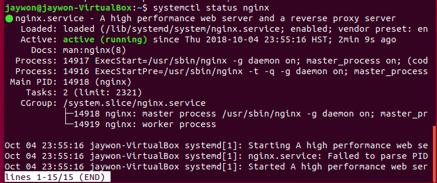

# Security+ - HTTP/HTTPS and Nginx 

#### Pre-requisites:
* Basic network understanding
    * Subnet/CIDR Notation
    * Ports
* Wireshark
* Virtualbox w/ Kali
* Virtualbox w/ Ubuntu
    
##### Desired Outcome(s):

* Understanding of the purpose of the HTTP protocol
* Understanding of the purpose of the SSL protocol
* Understanding of the structure of the HTTP(S) packets
* Understanding of what HTTP headers are
* Understanding of what cookies are
* Understanding of using Nmap to scan open ports on a system
* Understanding of capturing HTTP and HTTPS traffic on a network
* Understanding of the process of installing a proxy server
* Understanding of the process of installing an SSL certificate (optional)
    
#### Setup:

* Open VirtualBox

* Under Settings, select the Network tab for the following Virtual Machines:

    * Kali
    * Ubuntu 18.04

* Select the `Bridged Adapter` option in the `Attached to:` drop down menu

* Click the Advanced option

* Select the `Allow All` option in the `Promiscuous Mode:` drop down menu 


* Start Kali3 virtual machine 

* Start Ubuntu virtual machine

* Open a terminal and take note of your current assigned IP address for each machine using: 
    
    * Linux(Kali/Ubuntu): `ifconfig` or `ip addr`

**Linux (Kali and Ubuntu)**


* Start Wireshark on your **HOST** operating system

* On the start screen select your wireless interface of your **HOST** operating system

* In the `...using this filter:` box under the `Capture` section enter the following filter to only capture traffic from our Kali virtual machine

* Enter the following value: `tcp port 80 or 443'


* Hit Enter or click on the `Start capturing packets` button' to start your capture session

* In the Apply a display filter box, further filter your view to include `http`, this will show you only HTTP request/responses and not other misc. TCP requests

* Open your web browser and visit `http://www.stealmylogin.com/`

* You should start to see HTTP reply/response pairs show up in your packet capture window


**IMPORTANT:** Notice how a single request has multiple request/responses come back. These are all files required by that single web page. 

* If you right-click on the first packet and select the Follow->HTTP Stream option, you will see all requests/responses in a single view in plain text which will contain an HTML response along with HTTP request and response headers.


* Next go to http://google.com

    * You will be redirected to `https://google.com` which uses SSL encryption and makes it much harder to filter on traffic for a specific site because the HTTP headers are encrypted as well, neither Wireshark or an attacker can see them 
    
* There are several filters you can use to see traffic more clearly:

    * All HTTP Traffic (won't show HTTPS trafic): `http`
    * Filter by domain (with name resolution enabled): `http.host == "www.stealmylogin.com"`
    * Filter by HTTPS: `ssl`
    * Filter by HTTP and HTTPS: `http or ssl`
    * Filter by domain names (contains): `http.host contains ".com"`
    * Filter by domain names (explicit): `http.host == www.stealmylogin.com`
    * Filter by extension (contains): `http.request.uri contains ".html"`

* Next we're going to go into our **KALI GUEST** virtual machine and run the following scan against the IP address of our **UBUNTU GUEST** to scan for open ports

* Run the following command, replacing with the IP address for **YOUR** Ubuntu guest machine to scan for services on **ALL** ports: `nmap -sV -p- 192.168.0.70`


* After your Kali scan has completed (may take a few minutes), run the following commands on your **UBUNTU GUEST**: 

```
sudo apt-get update
sudo apt-get install nginx
```


* Once the installation finishes check that the Nginx service is running with the following command: `sudo systemctl status nginx`



* Now that Nginx is running, go back to your **KALI GUEST** and try your Nmap scan again


* You can see that Nginx now opened a port and is listening on that port for traffic. What happens if you now browse to that IP and port on your Kali machine?


* Next, create a file in that directory called `wut.html` with the contents:
```
<html>
    <body>
        <h1>Wut is this magic?!?!?!</h1>
    </body>
</html>
```
* Now browse to `http://localhost/wut.html`

* Next, we'll browse to the Nginx configuration directory in the standard Linux configuration `/etc` directory with: `cd /etc/nginx`


TODO: Go over Nginx configuration and defaults
TODO: Capture in Wireshark
TODO: Create an insecure form in HTML to POST back to the same page and capture in Wireshark
TODO: Enable port 443 with no SSL and show it's a standard port
TODO: Change to enable SSL on port 443

#### Challenges
1. What does HTTP/HTTPS/SSL stand for?

#### Interesting Filter(s)


#### Resources
* https://www.digitalocean.com/community/tutorials/how-to-install-nginx-on-ubuntu-18-04