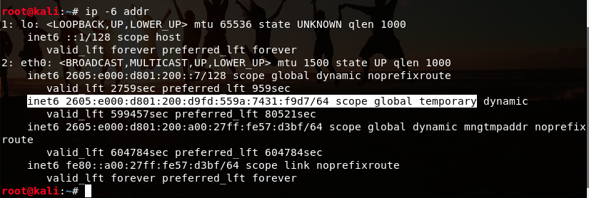

# Security+ - Ping Sweeps with Wireshark and Nmap

#### Pre-requisites:
    * Basic network understanding
        * Subnet/CIDR Notation
    * Virtualbox w/ Kali
    * Virtualbox w/ Windows or Ubuntu
    * Nmap
    
##### Desired Outcome(s):

    * Understanding of the `ping` utility
    * Understanding of the `fping` utility
    * Understanding of the `ICMP` protocol and it's purposes
    * Undrstanding of the structure of ARP packets
    * Understanding of capturing ICMP traffic on a network
    * Understanding of the concept of an Nmap ping sweep

    
#### Setup:

* Open VirtualBox

* Select the Network tab on your Kali virtual machine

* Select the `Bridged Adapter` option in the `Attached to:` drop down menu

* Click the Advanced option

* Select the `Allow All` option in the `Promiscuous Mode:` drop down menu 

* Start Kali3 virtual machine 

* Open a terminal and take note of your current assigned IP address using: `ifconfig`

**NOTE:** In some cases with VirtualBox it will use a IPv6 address and `icmpv6` method for pings. You may need to take note of your IPv6 address to filter the packets in Wireshark.

* Open a terminal and take not of your current assigned private IPv6 address using: `ip -6 addr`

* Start Wireshark on your **HOST** operating system

* On the start screen select your wireless interface of your **HOST** operating system

* In the `...using this filter:` box under the `Capture` section enter the following filter to only capture traffic from our Kali virtual machine

* Enter the following value: `icmp or icmp6`

* Hit Enter or click on the `Start capturing packets` button' to start your capture session

* On your **HOST** operating system, start a terminal session and run: `ping google.com`

* On your **GUEST** operating system, start a terminal session and run: `ping google.com`

* Analyze the results and take note of the following:

    * Echo request/reply pairs
    * ICMP packet structure
* Both Ethernet address and IP address
    
* You may see traffic from either the ipv4 address or ipv6 address with the following filters:

    * ip.src == 10.0.1.13
    * ipv6.src_host == fe80::a00:27ff:fe57:d3bf
    
* To make the input more easily readable, you can change the Source Name by right-clicking on a packet and selecting `Edit Resolved Name` and set the value to `Windows10`

* Once you change the name, you can change your filter to use the Resolved Name:

    * ipv6.src_host == Windows10

* Run a ping sweep using fping on the network you're on:
    * Ex. `fping -g 10.0.1.0/24`
    
* Run a ping sweep using nmap on the network you're on:
    * Ex. `nmap -sn 10.0.1.0/24`
    * NOTE: On a local network, Nmap will default to using ARP requests as they are faster
    
* Script a manual ping sweep using Bash and the ping utility on the network you're on:
    * `for i in {1..254}; do ping -c 1 10.0.1.$/$i; done` (only add single dollar sign, markdown bug)

#### Challenges
1. Try to change your filter to use your IP address and show traffic only from one host
1. Try to modify the names of the hosts to more easily identify which machine(s) traffic is going to/from
1. What is another way you could do a ping scan if the network administrator has ICMP traffic blocked?
1. What is the advantage of using `fping` vs `ping`?
1. What does ICMP stand for?

#### Interesting Filter(s)
Welchia Worm Tracking Filter:
`icmp[icmptype]==icmp-echo and ip[2:2]==92 and icmp[8:4]==0xAAAAAAAA`

#### Resources
* Ping Sweeps: https://www.slashroot.in/what-ping-sweep-and-how-do-ping-sweep
* Host Discovery: https://nmap.org/book/man-host-discovery.html

TODO: Test on Windows machine w/ wireless card that may not support promiscuous mode