# VirtualBox Setup & Overview

### VirtualBox is a hypervisor
A **hypervisor** is a software application installed on a physical server that manages the creation, runtime and networking configuration between the virtual machines that it manages. VirtualBox is a hypervisor.

### Installing an .iso
To install virtual machines as if we were installing an operating system from scratch we often start with a downloaded `.iso` file, which is the same file format that was used previously for CD-ROM/DVD-ROM installers. The `.iso` file is responsible for accepting default options for the user and formatting physical hard drive space for the new operating system.

First we need to specify that we are creating a **New Machine** by clicking on the **New** icon or using the Ctrl+N or Cmd+N shortcut to open the New Machine wizard.

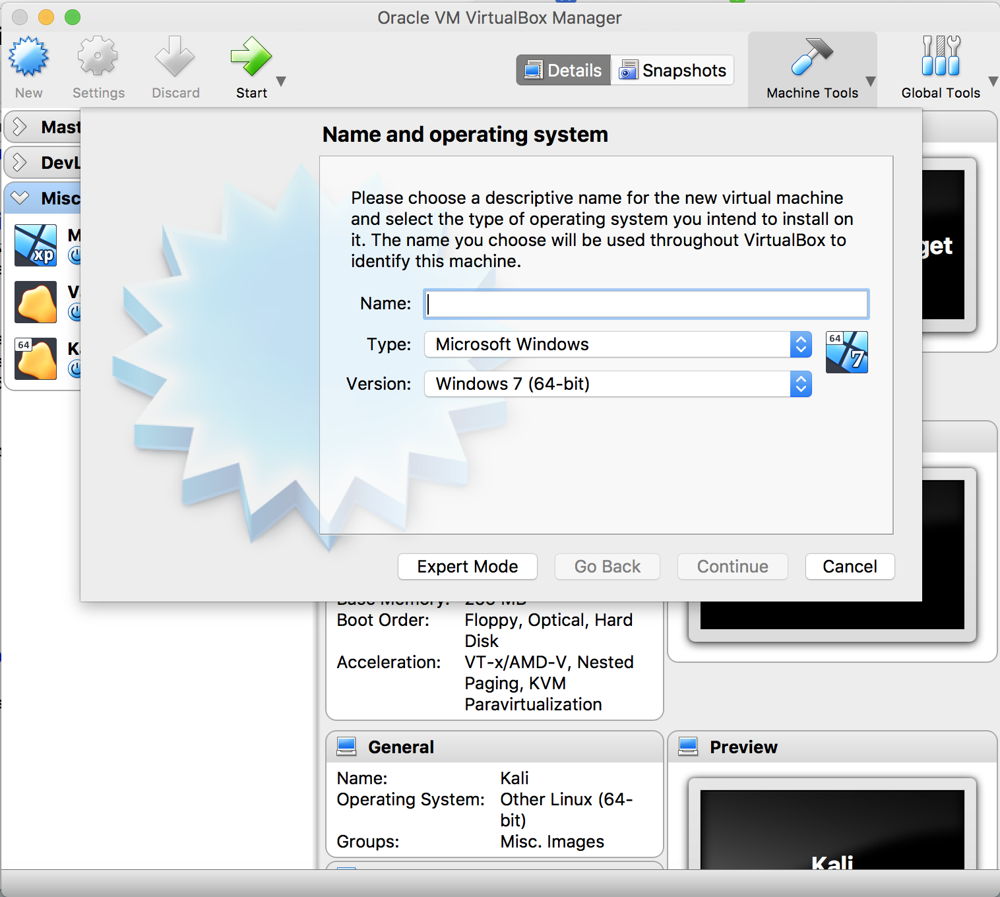

It's easier to setup a new virtual machine with less steps by clicking on the **Expert Mode** button:

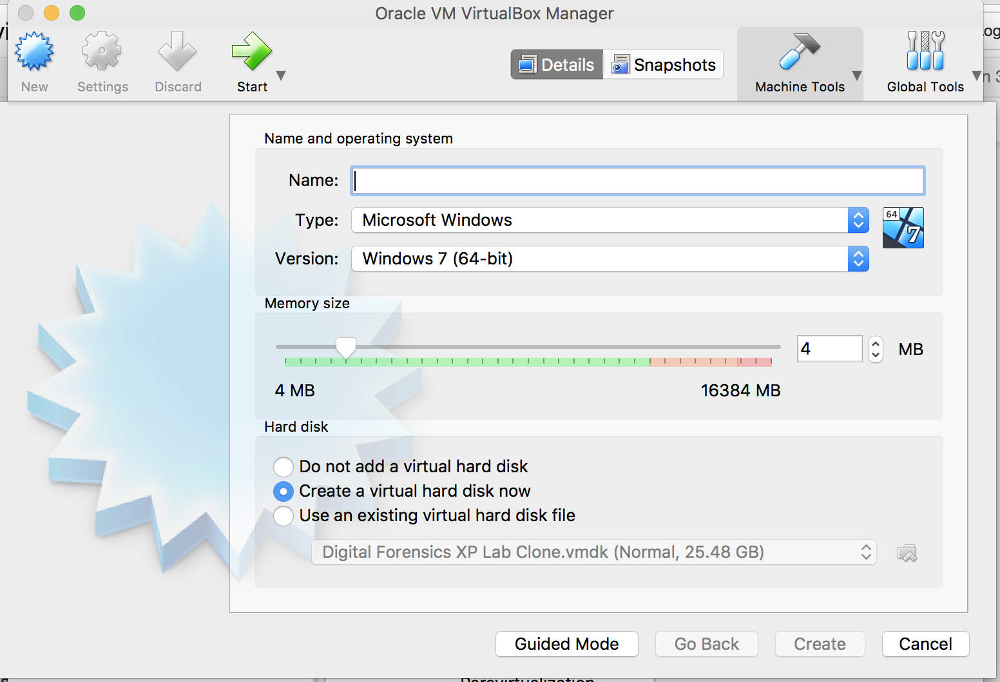

##### Name Your System and Select Operating System
Give your virtual machine a distinct and memorable name, as well as the vendor and processor architecture requirements (32-bit/64-bit) of the new operating system. You should know what type of processor architecture from where you download the image. Most newer operating systems will be 64-bit architectures.

In this step you can also select the amount of available RAM that you would like to allow this virtual machine to use from the system total. Your requirements will vary based on operating system and purpose.

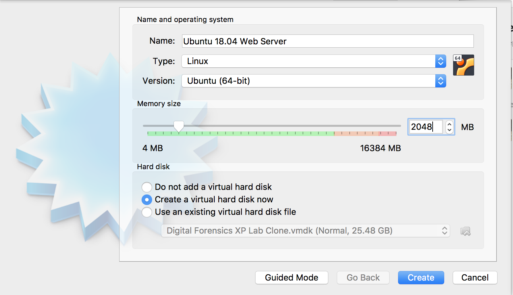

After clicking the **Create** button, you will go to the next step to configure the amount of hard drive space and location for the new virtual machine.

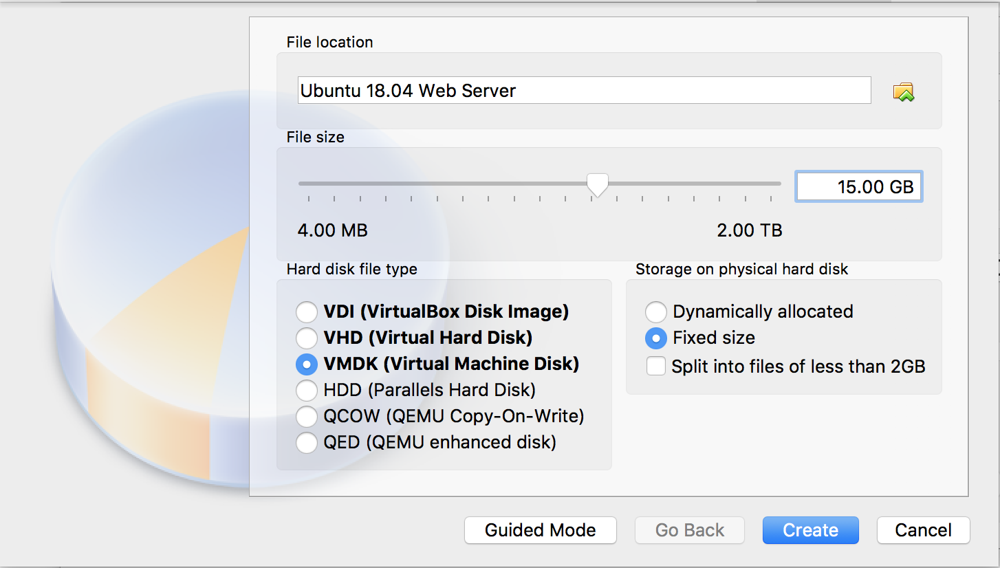

**NOTE:** You will be asked to select  **Fixed Size** or  **Dynamically Allocated** storage on physical disk options. If you select **Fixed Size** you will not be able to change this in the future, and with **Dynamically Allocated** remember that the guest will keep taking new disk space from the host as it needs over time.

After clicking the **Create** button, VirtualBox will claim the specified disk space and add the virtual machine entry to your list of machines.

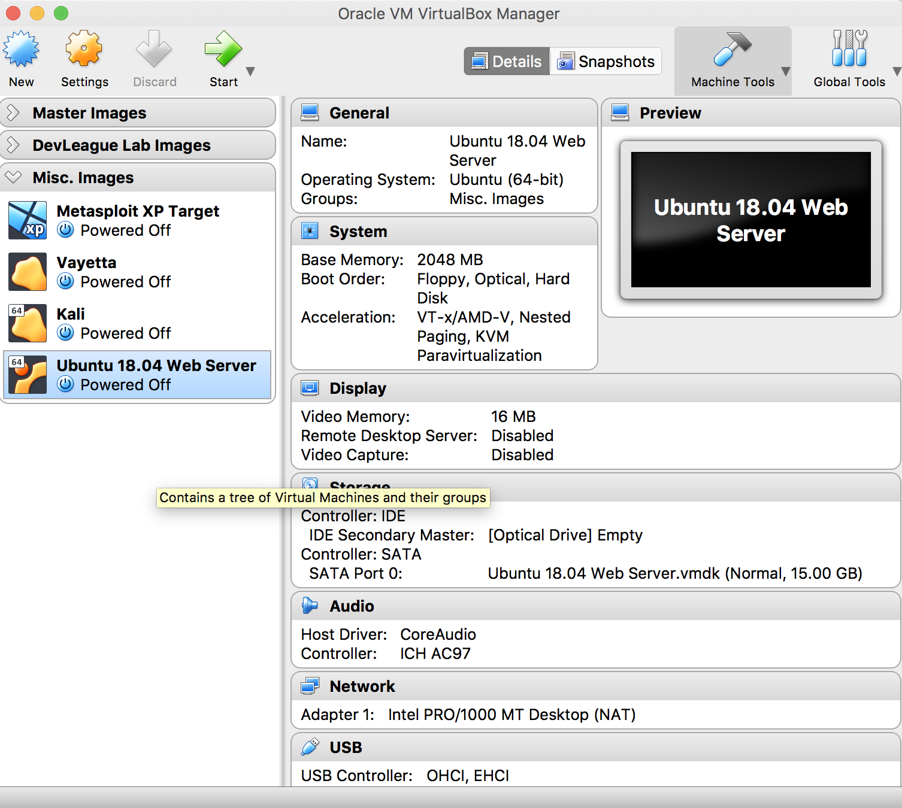

Now if you double-click on the machine to start the new machine, you will be asked to browse to the `*.iso` file that you would like to use to install your operating system of choice.

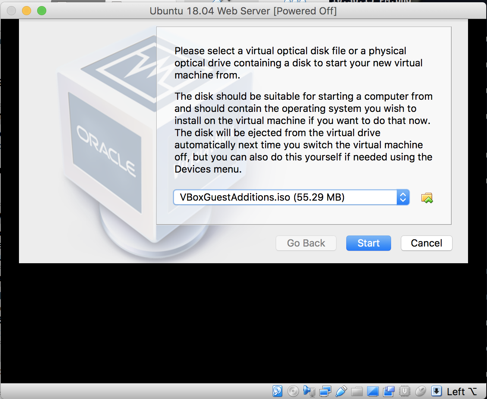

If for any reason, you close out of this dialog, it may not ask you again. In that case simply click on the **Settings** button for the machine and add an **Optical Drive** to the machine in the **Storage** tab. 

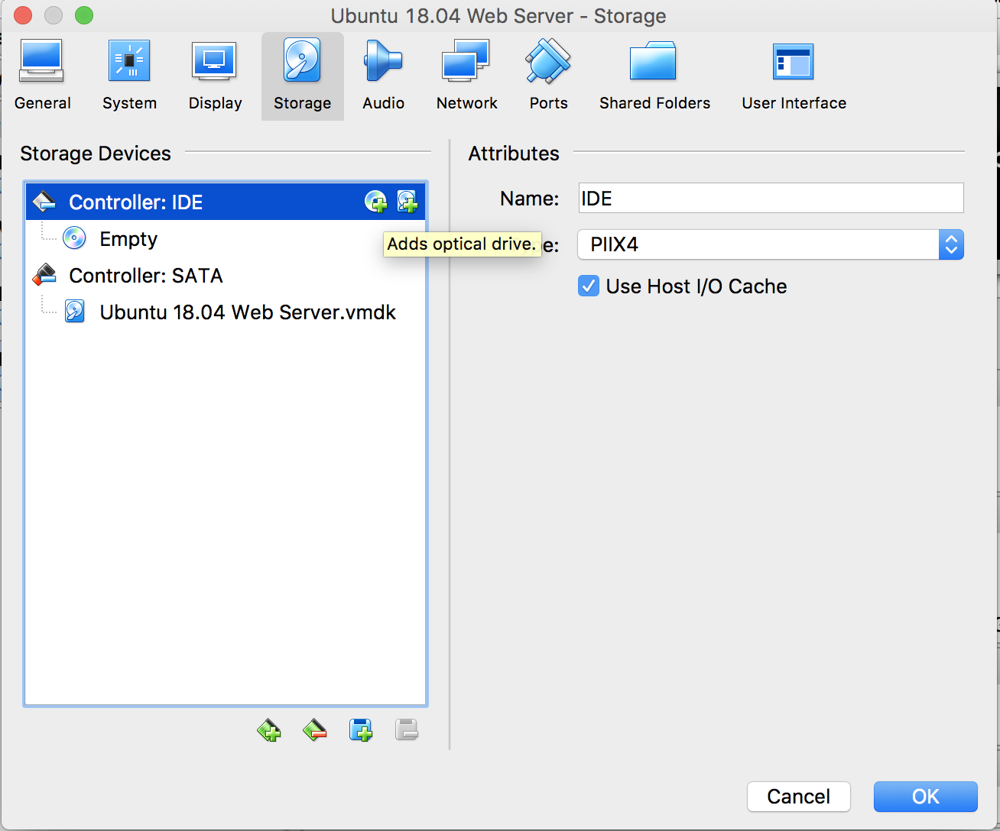

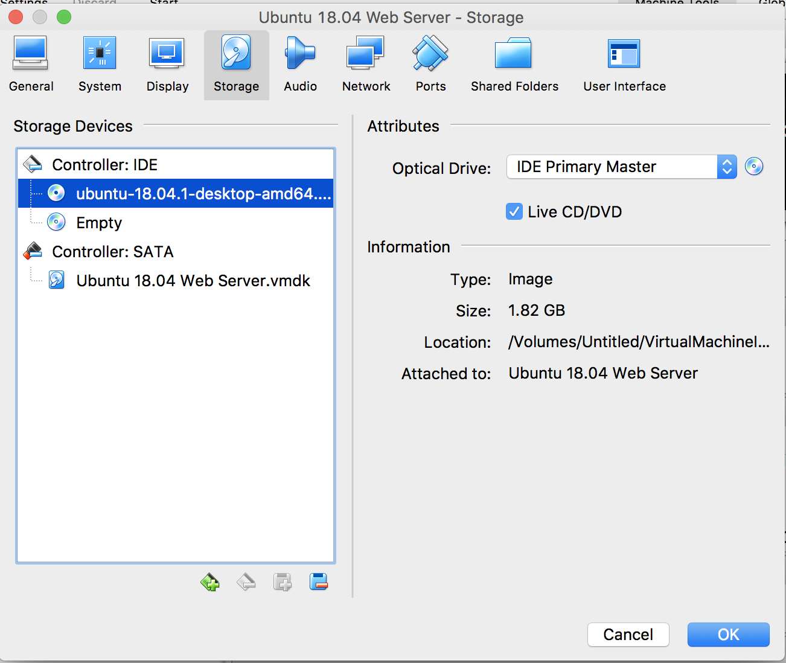

**NOTE:** Make sure to check the **Live CD/DVD** option when setting up an **.iso** as an optical drive

After starting the machine in either case, the following installation steps will vary based on operating system.

### Installing a .ova
Sometimes you will receive an `.ova` file that someone else has created that does not require all of the configuration and installation steps detailed in the previous section. An `.ova` is fully configured operating system that has been customized for a specific requirement. 

**NOTE:** There are a lot of CTF training images at https://www.vulnhub.com/ in this format that are great for practice!

### Virtual Image Disk Types

There are 3 different types of virtual hard drive types in VirtualBox:

1. **OVA** - Virtual Box proprietary format

1. **VMDK** - Virtual Machine Disk - Portable between both VirtualBox and VMWare

    * Preferred option when creating you own virtual hard drives
    
1. **VHD** - Virtual Hard Drive - Microsfot Windows virtual hard drive format

### Creating A Snapshot

For managing labs, we don't usually use snapshots, but in a production systems environment, snapshots allow us to roll back to previous moments in time. Common cases are when data corruption occurs or somekind of malware or virus infects a system.

### Disk Space Considerations
Managing many virtual machines can take a **LOT** of hard drive space on your computer. It's very easy to start to take up to 100-200GB of disk space when managing multiple labs and images. 

**TIP:** If possible, it can be helpful to buy a 1TB external USB3.0 hard drive to store `.iso` images and it's possible with a good drive to install your `.vmdk` images there as well to conserve disk space on your primary hard drive

To see how much space you are currently using for current and possibly identifying old virtual machine disk image files that weren't cleaned up you can use the *Virtual Media Manager* by going to *Global Tools -> Virtual Media Manager*

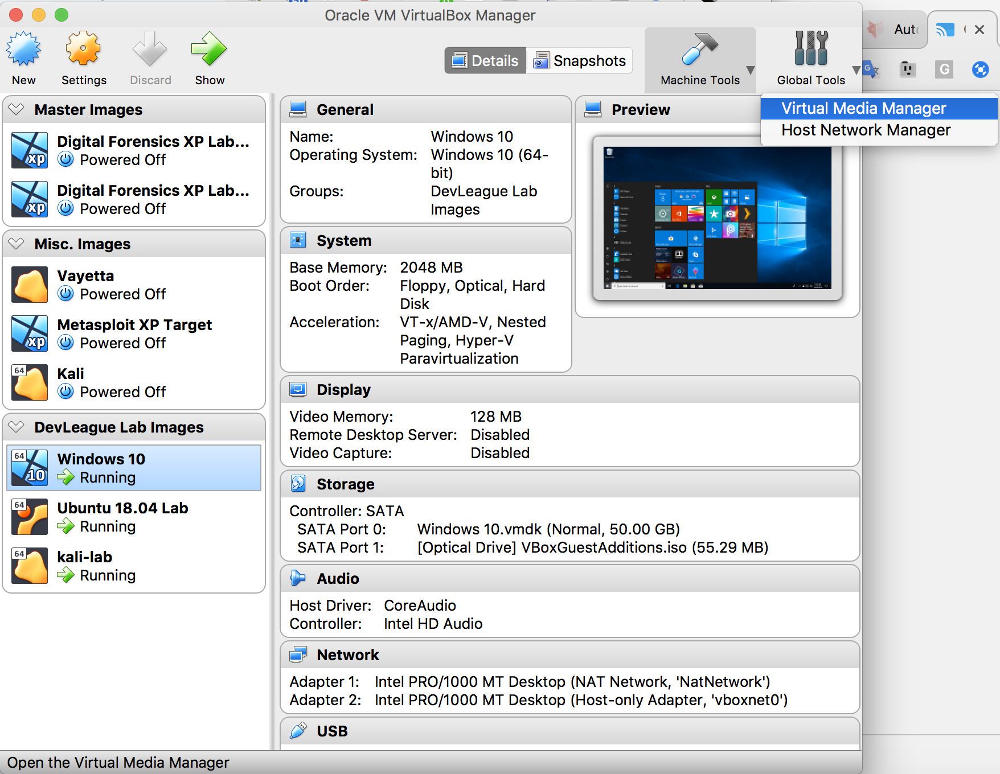

The Virtual Media Manager will allow you to see:
    
    * All of the virtual hard drives that you have created
    * Where they reside on your hard drive
    * How much disk space they are currently using
    * For dynamically allocated hard drives, you can adjust the amount of space

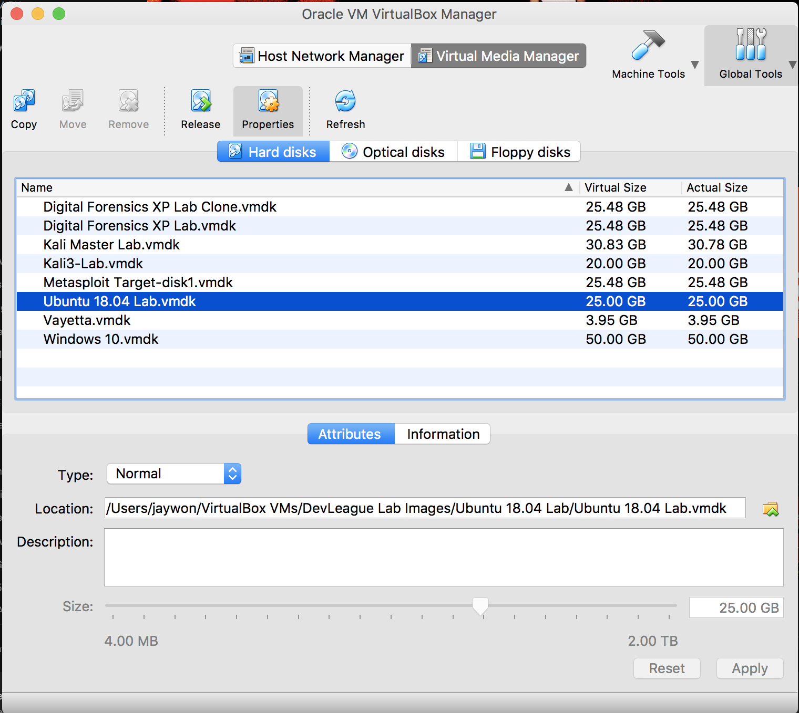

### Installing Guest Additions
Guest Addtions is a common way to add additional functionality to our virtual machines that we'll be interacting with more frequently such as when we run labs where we have the need to copy and paste or drag and drop files between our host and guest operating systems.

Some of the functions that are enabled when installing Guest Additions are:

    * Shared clipboard between host and guest, one way, or bidirectional
    * File drag/drop capabilities between the host and the guest, one way, or bidirectional

To install Guest Additions, we have to have a running virtual machine that has already been installed. Go to the Devices -> Insert Guest Additions CD Image in the chrome window of your virtual machine.

##### Windows
In Windows, you will see a prompt to run a Windows Installer. Follow the prompts through installation and Restart Windows.

##### Linux
In Linux, the drive will be _mounted_ to the file system and you will need to take the following steps to install Guest Additions in both Ubuntu and Kali.

You should see a CD-ROM icon on your desktop.

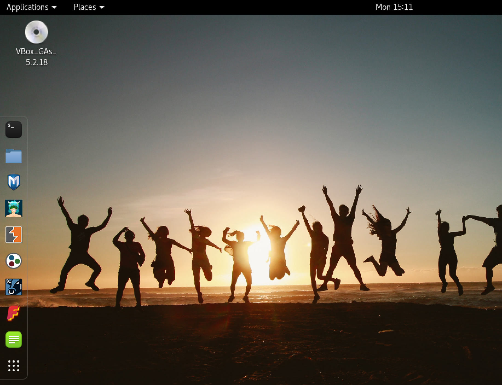

Open a terminal and run the following commands:

    * `cd /media/cdrom`
    * `cp VBoxLinuxAdditions.run ~/Desktop/.`
    * `cd ~/Desktop`
    * `chmod +x VBoxLinuxAdditions.run`
    * `./VBoxLinuxAdditions.run`
    
**NOTE:** In Ubuntu you may need to run the commands with `sudo` if you are not running as the `root` user.
    
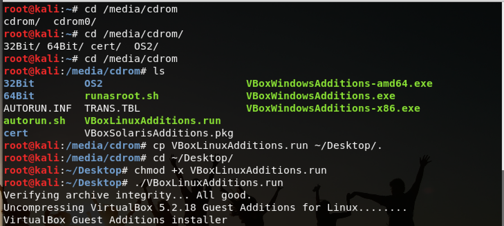

Reboot the machine, and you should be able to enable drag and drop and shared clipboard from the Devices drop down menu.

### Full Screen Mode
You can go to Full Screen mode in your virtual machines and depending on your operating system, you may be able to easily switch between workspaces as you work in the various different operating systems.

### Shared Directories
An alternative to trying to drag and drop images between the host and the guest is to **share** a directory from the host to appear as directory within the virtual machine.

**NOTE:** Depending on the type of environment you are working within you may not want to have a part of the host operating system mounted to the virtual machine. You do have the option to have the directory be in read-only mode to disallow the virtual machine from writing new files to that directory.

We won't be using this option in our labs for the course.

### Grouping Images
It's often a good idea to group images together whether it's grouped by type or function(Web Servers/Database Servers) or logical grouping(DevLeague Labs/PenTesting Labs).

To group a collection of images, select them and right-click and select the Group option.

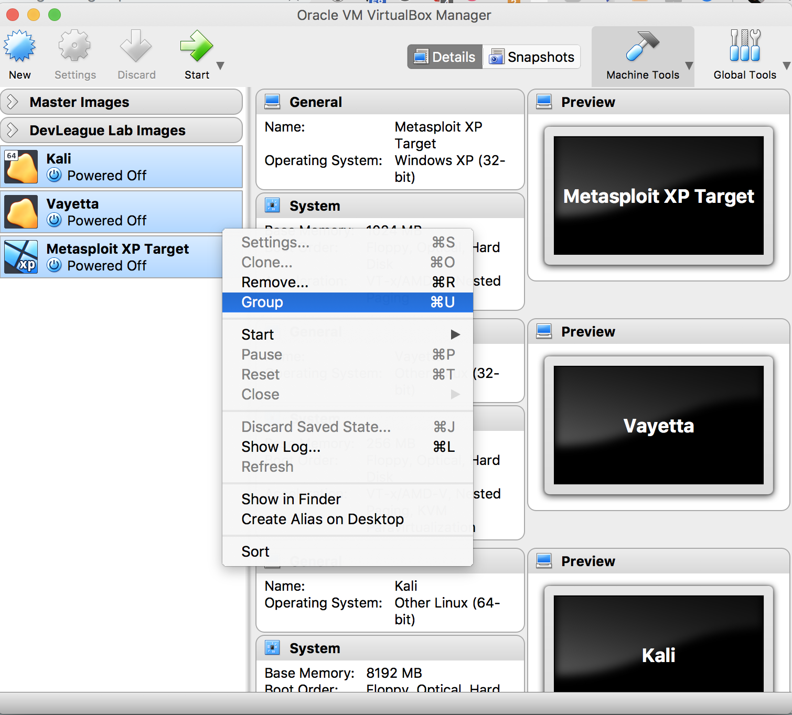

You can then rename your group to identify the collection:

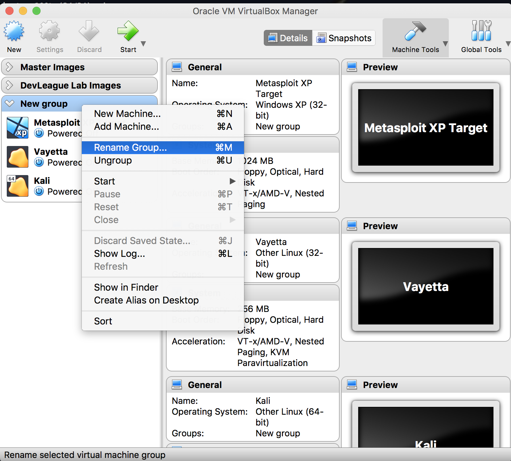

You can also enter the group to just see those images that you are working with:

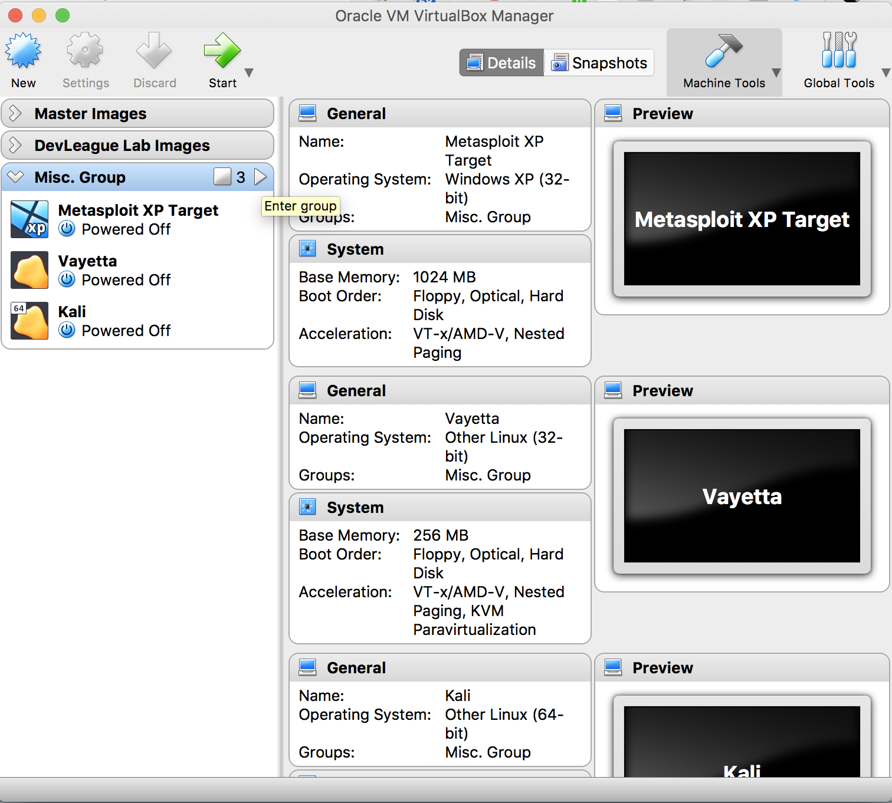

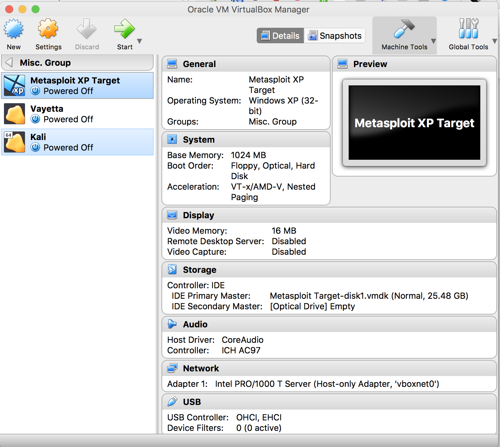

**TIP:** You can start all machines in a group at once by highlighting all images and right clicking on the area, or by right clicking on the name of the group and select the Start option. 

**TIP:** You can also drag a single image into multiple groups by holding the Alt key on Windows/Linux or the Option key on Macs and drag an existing image into another group. The same image will now have a placeholder in both groups.

### Master Image Creation
Often times, in working with lab machines, you will be working in a disposable environment but want to go back to a consistent base image. In this case we will often want to create a single master image that we can use for other labs in the future without the need to install the operating software and various other software components.

### Cloning Images
If you have a master image created from a previous installation, you can simply create a new environment with pre-installed software, users, and other configurations by using the clone option of VirtualBox to create a replica of your master image.

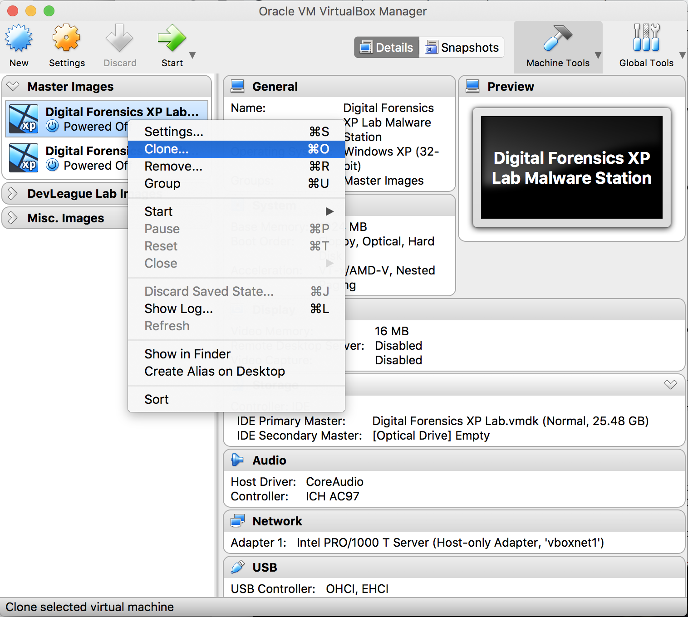

### Custom Networks
For a lot of the course, we will use VirtualBox to simulate various different types of network environments. We have the ability to both leverage the networks we are on, but also create completely isolated network environments as well.

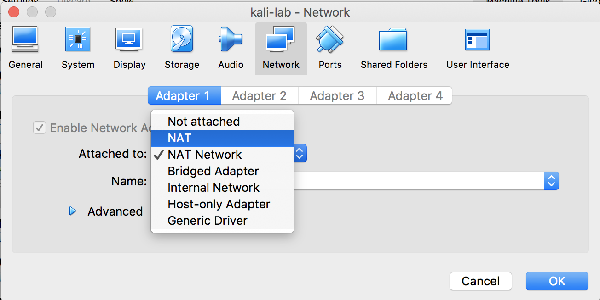

**NOTE:** When you change the type of network you're on you can restart your network interface inside your guest machine rather than restarting it.

#### Network Settings

##### NAT
The **NAT** option is similar to how your home WiFi network works is that you are assigned an  IP address on a virtual private network which no one else can access that IP address directly but you can reach the internet and receive responses via the NAT gateway. Many virtual machines running with this option at the same time would all be on separate virtual networks.

##### NAT Network
The **NAT Network** option is identical to the **NAT** option with the exception that any other virtual machines on the virtual private network can reach each other on the private network in addition to reaching the internet and receive responses via the NAT gateway. Many virtual machines running with this option at the same time could, if configured to use the same network, will be on the same virtual network.

##### Bridged Adapter
The **Bridged Adapter** option is an option where the virtual machines don't rely on VirtualBox to create a virtual network but go to the physical router that your host is connected to and are assigned a unique IP address via DHCP by the router and can be seen by any other computers on that network as if they **weren't** virtual machines at all.

##### Host-only Adapter
The **Host-only Adapter** option will create a virtual network in which the host and any configured virtual machines can see each other but will not be able to reach the internet or be reached from outside that virtual network. 

##### Internal Network 
The **Internal Network** option is similar to the **Host-only Adapter** option with the exception that even the virtual machine host will not be a part of that network. It is virtual network that is **only** for virtual machines. They cannot reach the internet, nor can they be reached outside the virtual network.

### Running in Headless Mode
Depending on how much CPU and RAM you have, or out of convenience, you may prefer to run your machine in *Headless Mode* for when you don't need to login to and use the GUI desktop of some of the virtual machines you are using. In these cases you can run them in `Headless Mode` and you will still be able to interact with them over the network but will not need the bandwidth to power the desktop for those machines. 

With proper configuration you can access them remotely via SSH as well and control them via the command line.

**NOTE:** We will cover this configuration in a future lab.

#### Resources
* https://jekewa.com/blogs/index.php/weBlog/2014/01/09/virtualbox-4-3-adds-nat