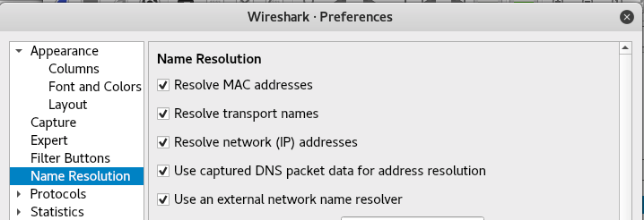
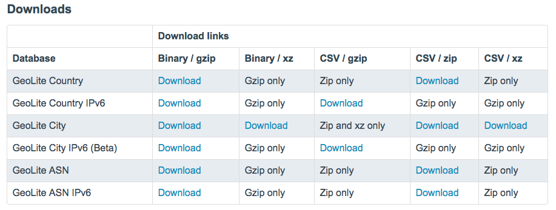
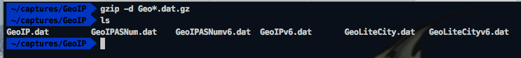
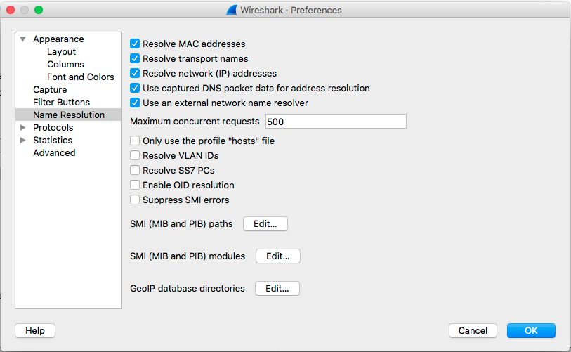
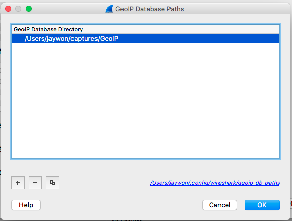
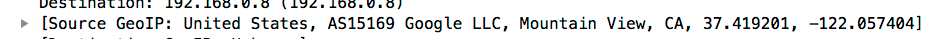

### Wireshark Filters
- https://wiki.wireshark.org/CaptureFilters
- https://www.wireshark.org/docs/man-pages/wireshark-filter.html

#### Comparison Operators

Examples: 
    - not ip.src_host eq MacBook-Pro-4.local && not ip.dst_host eq MacBook-Pro-4.local
    - http or ssl
    
### Enable Name Resolution
We want to be able to use DNS to see the names of hosts if possible in our captures, to enable all Name Resolution go to: `Preferences->Name Resolution` and make sure the following boxes are checked:

    * Resolve transport names
    * Resolve MAC addresses
    * Resolve network (IP) addresses
    

### Create Directory to Save Packet Captures
* Create a `captures` directory in your `DevLeague` directory

### Geo IP Database Download & Setup

* Create a directory called `GeoIP` in your `captures` directory where 

* Go to https://dev.maxmind.com/geoip/legacy/geolite/

* Download all of the files in the Downloads sections to your `captures\GeoIP` folder

* Browse to your directory folder in a terminal session and run the following commands to decompress the `gzip` files

* Open your Wireshark->Preferences window

* Click on the `GeoIP database directories` Edit

* Add your `DevLeague/captures/GeoIP` directory to Wireshark (image has different path, use **YOURS**)

* You should now be able to see GeoIP location data in your scan results

